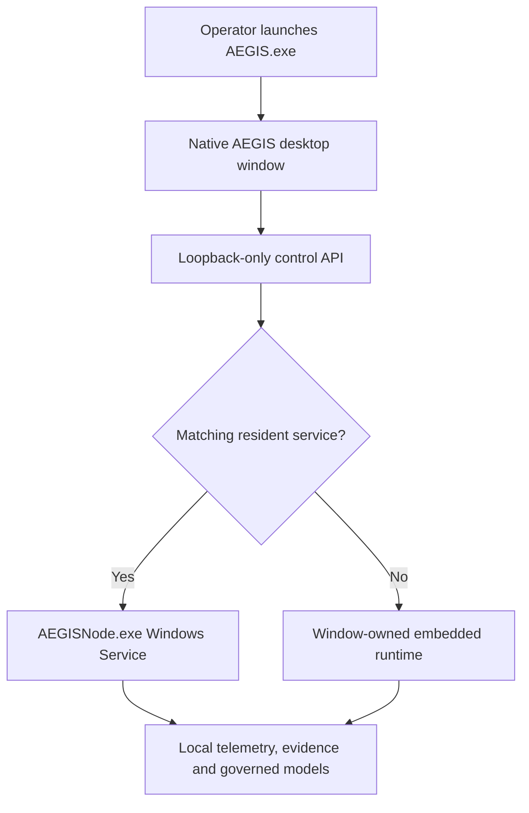

# AEGIS desktop product guide

Version 1.2.0 · native Windows foundation · 23 August 2026

## 1. The short answer: this is no longer a browser product

AEGIS v1.0 already ran locally, but its analyst console opened in the user's
ordinary browser. That was technically a local application, yet it still looked
and felt like a website. Version 1.1 corrects the product boundary:

- the user launches `AEGIS.exe` from Windows;
- Windows creates a dedicated AEGIS application window;
- there is no address bar, browser tab, public URL or hosted backend;
- the interface and API continue working without internet access;
- an installed `AEGISNode.exe` service remains active when the window closes.

The UI still uses HTML, CSS and JavaScript internally because that preserves the
existing premium console and makes complex investigation views maintainable.
Those assets are rendered by Windows WebView2 inside AEGIS's own native window,
in the same way many desktop products embed an operating-system web component.
The distinction is deployment and trust: the renderer is an internal component,
not the product's network location.

Microsoft documents WebView2 as an application runtime and preinstalls its
Evergreen form on Windows 11 and eligible Windows 10 systems. Evergreen receives
security updates through the platform; enterprise qualification must therefore
include compatibility testing against updated runtimes:
[WebView2 Evergreen versus fixed runtime](https://learn.microsoft.com/en-us/microsoft-edge/webview2/concepts/evergreen-vs-fixed-version) and
[WebView2 enterprise guidance](https://learn.microsoft.com/en-us/microsoft-edge/webview2/concepts/enterprise).

## 2. Runtime topology



The two execution modes use the same event, evidence, safety, model and policy
contracts.

| Mode | Runtime lifetime | Data location | Intended use |
| --- | --- | --- | --- |
| Installed | `AEGISNode` starts automatically and survives UI closure | `%ProgramData%\AEGIS` | Endpoint pilot and future licensed deployment |
| Portable | Embedded runtime starts with `AEGIS.exe` and stops on window close | `%LOCALAPPDATA%\AEGIS` | Demonstration, development and user-level evaluation |
| Source | `python -m aegis.desktop` | Configurable | Research and debugging |

The desktop refuses to attach to an older resident release. It starts a separate
ephemeral loopback instance instead, avoiding accidental UI/API contract mixing.

## 3. Desktop security controls

The native shell is not treated as a security boundary by itself. Versions 1.1
and 1.2 add controls around the local renderer and API:

1. the HTTP listener binds to `127.0.0.1` only;
2. portable mode asks the operating system for a random available port;
3. desktop-mode requests reject non-loopback `Host` values;
4. each runtime generates or loads a high-entropy session token;
5. every mutating API request must present that token;
6. the token is injected only into the locally served AEGIS document;
7. framing is denied and same-origin resource/opener policies are emitted;
8. downloads, external navigation and remote debugging are disabled;
9. WebView storage runs in private mode;
10. a server-assigned role must contain the route scope;
11. the current offline license must contain the route entitlement;
12. AEGIS must seal an audit preflight before a route can execute; and
13. closing a portable window orders the scheduler and API to stop cleanly.

These controls reduce browser-origin and DNS-rebinding-style interaction risk.
They do not replace operating-system account separation, endpoint hardening,
signed binaries, encrypted state, enterprise identity or a formal penetration
test.

## 4. Executable layout

The Windows build creates two one-folder executables rather than hiding every
component inside one giant self-extracting file:

```text
AEGIS-Desktop-v1.2.0-win64/
├── AEGIS-Desktop/
│   └── AEGIS.exe
├── AEGIS-Node/
│   └── AEGISNode.exe
├── INSTALL_AEGIS.bat
├── Install-AEGIS-Desktop.ps1
├── Uninstall-AEGIS-Desktop.ps1
├── README.md
└── LICENSE.txt
```

This layout starts faster, makes component inventory easier and avoids writing
bundled application files into a temporary directory on every launch. The
PyInstaller specification explicitly includes the console assets and excludes
unused GUI frameworks. PyInstaller's official documentation recommends a spec
file when data files and packaging behavior must be controlled:
[PyInstaller spec files](https://pyinstaller.org/en/stable/spec-files.html).

The build inputs are pinned to `pywebview==6.2.1`,
`pyinstaller==6.22.2` and `cryptography==46.0.0`. The pins make the v1.2
packaging experiment repeatable;
they must still be reviewed and deliberately advanced as security updates are
released.

## 5. Build AEGIS.exe on the Victus laptop

Windows executables must be frozen on Windows. From the extracted v1.2 source:

1. confirm Python 3.10 or newer is installed;
2. double-click `BUILD_AEGIS_EXE.bat`;
3. allow the dependency installation to finish;
4. wait for all 88 tests and the packaged-runtime smoke check;
5. open the newly created `release` folder.

The output includes:

- `AEGIS-Desktop-v1.2.0-win64.zip`;
- `AEGIS-Desktop-v1.2.0-win64.sha256`.

The build environment is isolated under `.aegis-build`; it does not modify an
installed AEGIS service. The GTX 1650 is not required for packaging. The current
models and console are CPU/RAM-light enough for the 8 GiB Victus, although
closing memory-heavy programs is sensible during the build.

## 6. Install and operate

Extract the Windows ZIP and double-click `INSTALL_AEGIS.bat`. After UAC
approval, the installer:

- validates both executable trees;
- installs the version under `%ProgramFiles%\AEGIS\app-1.2.0`;
- creates a random per-install console token under `%ProgramData%\AEGIS`;
- applies a restricted machine-data ACL for the database, token, local keys and
  optional license material;
- registers `AEGISNode` for delayed automatic startup;
- configures bounded service-restart recovery;
- creates the AEGIS Start-menu shortcut; and
- waits for the exact v1.2 health response.

Microsoft's Service Control Manager supports delayed automatic services and
failure recovery; AEGIS uses those mechanisms without opening a firewall port:
[SC service creation](https://learn.microsoft.com/en-us/windows-server/administration/windows-commands/sc-create) and
[service configuration with SC](https://learn.microsoft.com/en-us/windows/win32/services/configuring-a-service-using-sc).

Opening AEGIS from the Start menu attaches the window to the resident service.
Closing the window does not stop collection. Uninstallation preserves telemetry,
evidence and keys unless the explicit destructive data-removal switch is used.

For a signed offline evaluation, run the PowerShell installer directly and pass
both materials together:

```powershell
.\Install-AEGIS-Desktop.ps1 `
  -LicensePath "C:\SecureDelivery\license.json" `
  -LicensePublicKeyPath "C:\SecureDelivery\aegis-license-public.pem" `
  -DesktopShortcut
```

The private authority key never belongs on the endpoint. See
`LICENSE_AUTHORITY_RUNBOOK.md`.

## 7. What has been validated

The v1.2 source checkpoint has 88 passing tests. Desktop-specific tests verify:

- product/version consistency;
- deterministic data-root selection;
- endpoint identity probing;
- token injection into the local document;
- refusal of untokened mutations;
- acceptance of a correctly tokened operation;
- viewer/analyst/administrator separation;
- valid, tampered, expired and not-yet-valid Ed25519 license envelopes;
- two-stage accepted/completed command receipts;
- append-only audit triggers, tamper detection and key-loss lockout;
- resident-service attachment without stopping that service; and
- start/health/stop behavior of the packaged-runtime contract.

Static checks also validate Python syntax, JavaScript syntax, unique HTML IDs,
workspace count and selector coverage. The Windows builder additionally refuses
to emit a release if source tests, either PyInstaller build, required-file check
or frozen-runtime smoke check fails.

The actual Windows binaries must still be produced and exercised on Windows;
PyInstaller is not a cross-platform compiler. A Linux-created executable would
not be valid evidence for a Windows release.

## 8. Commercial-release gates

Before licensing this build to a company, complete all of the following:

- organization-owned Authenticode signing for both executables and installer;
- reproducible dependency lock with hashes and an SBOM;
- malware scanning and independent application-security review;
- Windows 10/11 clean install, upgrade, reboot, crash, repair and uninstall tests;
- least-privilege service identity and ProgramData ACL review;
- enterprise identity binding, named-session expiry/revocation, read-route
  authorization and remote audit-head anchoring;
- an embedded vendor public-key trust anchor, offline revocation/rotation and
  HSM-backed license-authority custody;
- encrypted key/state protection using Windows facilities or hardware-backed keys;
- signed update and rollback channel;
- measured performance and false-positive behavior using authorized telemetry;
- privacy, employee-monitoring, retention and incident-response review.

Version 1.2 establishes the native product shape and a testable licensed-
operator boundary. It does not convert the
synthetic research results into enterprise accuracy claims and does not enable
external scanning, person identification, hack-back or packet enforcement.
