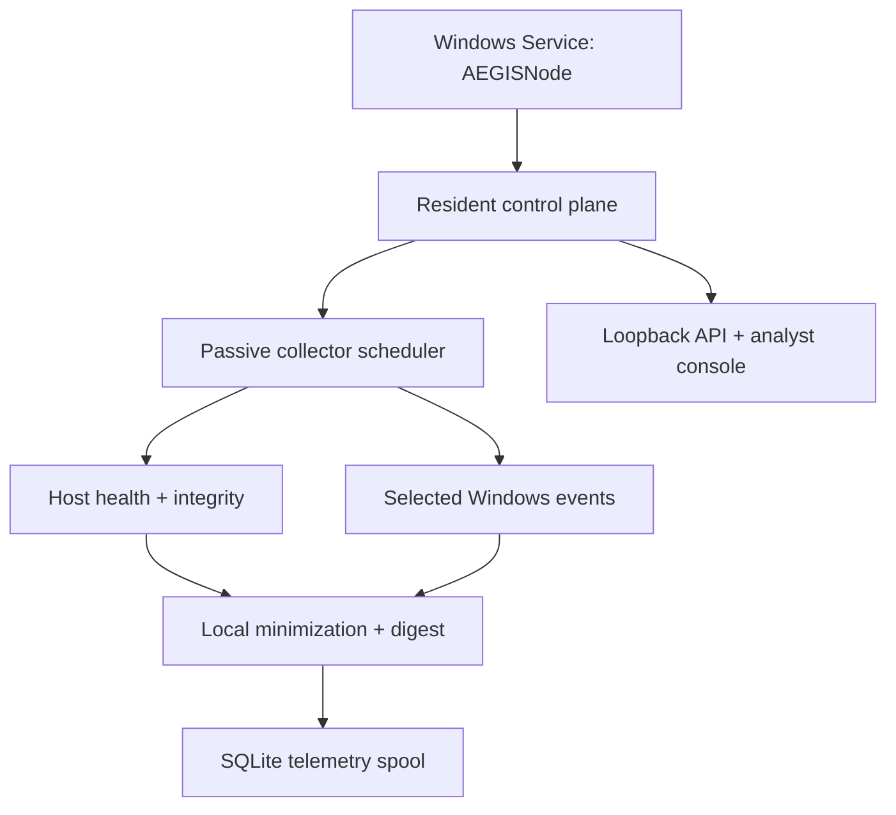

# AEGIS resident endpoint deployment

Version 1.2.0 · Desktop Research Edition · 23 August 2026

This guide explains the application that now lives behind the console, what it
collects, how to install it, and which production controls are still missing.

## Truth statement

The resident runtime, local database, scheduler, host-health collector,
runtime-integrity collector, HTTP lifecycle and clean shutdown have been executed
in this development environment. Windows Event Log parsing, minimization,
pseudonymization, bounded command construction and Windows-service contracts are
covered by automated fixtures. The installer and SCM host have not yet been
executed and signed on an isolated Windows qualification machine. They are a
Research Edition package, not a production endpoint-security agent.

## Runtime topology



The native desktop window can close without stopping `AEGISNode`. Nothing listens beyond
`127.0.0.1` unless an operator deliberately changes the host argument. There is
no outbound telemetry, Evidence Gateway transport or model-promotion transport
in v1.2.

## What the node collects

| Source | Persisted data | Explicitly excluded |
| --- | --- | --- |
| Host health | Platform, architecture, logical CPU count, available memory, free storage, AEGIS uptime and optional one-minute load | Files, process list, browser data, keystrokes, screen content |
| Runtime integrity | AEGIS release, number of measured code/UI files and one aggregate SHA-256 manifest | Source-file contents and unrelated files |
| Windows Security | Selected IDs 4624, 4625, 4688, 4719, 4720, 4740 and 1102 | All unselected event IDs and unapproved fields |
| Windows System | Selected ID 7045 | All other System events |

Field handling for Windows events:

| Field family | Stored representation |
| --- | --- |
| Username, IP address, workstation, service name | Stable local HMAC reference; raw value discarded before SQLite |
| Process path | Lowercase basename only |
| Command line | Never selected or stored |
| Logon/status flags | Bounded allowlisted text |
| Provider/channel/record/event ID/time | Retained for provenance and deduplication |

Microsoft documents `wevtutil` as the operating-system command for querying and
retrieving event-log information. AEGIS invokes `wevtutil qe` with a fixed
argument list, an XPath event/time filter, result ceiling and timeout. See the
official [`wevtutil` reference](https://learn.microsoft.com/en-us/windows-server/administration/windows-commands/wevtutil).
The selected authentication and process IDs are also represented in Microsoft's
[Windows security-event set](https://learn.microsoft.com/en-us/azure/sentinel/windows-security-event-id-reference).

## Privacy and integrity mechanics

1. Installation creates a random 32-byte `node.key` with restrictive local
   permissions where the operating system supports POSIX-style modes.
   Governance initialization separately creates `registry.key`; the two keys
   have different trust purposes and must not be substituted for one another.
2. Identity-like fields are normalized by type and value, then transformed with
   HMAC-SHA-256. Only a short typed reference is persisted.
3. Every full normalized observation is canonicalized and SHA-256 hashed.
4. The digest becomes a unique database constraint, so overlapping ten-minute
   event windows cannot duplicate the same event.
5. Collector executions retain state, duration and counts. One collector can be
   `PERMISSION_REQUIRED` or `ERROR` while the resident node stays available.

Protect `aegis.db`, `node.key` and `registry.key` together. Losing or
deliberately rotating `node.key` changes future pseudonymous references and
breaks longitudinal linkage. Losing `registry.key` prevents verification or
extension of existing local artifact/decision attestations. A corrupt short key
fails closed rather than silently weakening HMAC protection.
The current release has no automatic retention or secure-erasure policy; this is
a required enterprise control.

## Native desktop and resident-service topology

The supported v1.2 operator path is `AEGIS.exe`, not an ordinary browser. The
desktop executable creates a dedicated WebView2 application window and probes
the exact v1.2 health contract at `127.0.0.1:8765`. When the installed service
is healthy, the window attaches without owning or stopping it. Otherwise it
starts a window-owned runtime on an ephemeral loopback port and stores its data
under `%LOCALAPPDATA%\AEGIS`.

The generated Windows package contains a separate `AEGISNode.exe` so the
resident collector can start under the Service Control Manager without Python
being installed on the target endpoint. Mutating local-API calls require the
session token injected into the AEGIS document. This protects against unrelated
web origins; it is not a substitute for Windows user/service isolation.

See `DESKTOP_PRODUCT_GUIDE.md` for the build, install, security and
commercialization boundary.

## Foreground verification

Before service installation, run the resident lifecycle in a terminal:

```powershell
py -3 -m aegis.windows_service --console --port 8765
```

Then run `python -m aegis.desktop`, open **Telemetry Nexus**, press **Collect
telemetry now**, and inspect each collector state. The Windows collector may show
`PERMISSION_REQUIRED` if the current account cannot query the Security log.

## Install the Windows Service

From an elevated PowerShell window in the extracted release directory:

```powershell
Set-ExecutionPolicy -Scope Process Bypass
.\install\Install-AEGIS.ps1
```

The script:

1. validates that the source release contains `aegis`, `web` and
   `pyproject.toml`;
2. copies v1.2 into `%ProgramFiles%\AEGIS\app-1.2.0`;
3. creates a dedicated Python virtual environment under
   `%ProgramFiles%\AEGIS\runtime`;
4. installs the pinned Ed25519 verifier dependency;
5. restricts `%ProgramData%\AEGIS` to System/Administrators full control and
   Users read/execute;
6. optionally installs a paired signed license and public key;
7. registers `AEGISNode` for delayed automatic start;
8. configures bounded restart recovery;
9. stores the database and local keys under `%ProgramData%\AEGIS`; and
10. verifies the loopback health endpoint before reporting success.

Use `-Force` only for an intentional in-place service upgrade. The scripts do
not open a firewall port.

For an offline signed evaluation, add both `-LicensePath` and
`-LicensePublicKeyPath`. Supplying only one is refused. Never copy the private
authority key to the endpoint.

## Verify the installed node

```powershell
Get-Service AEGISNode
Invoke-RestMethod http://127.0.0.1:8765/api/health
Invoke-RestMethod http://127.0.0.1:8765/api/telemetry/status
Invoke-RestMethod http://127.0.0.1:8765/api/access/status
Invoke-RestMethod http://127.0.0.1:8765/api/audit/verify
```

Expected service state is `Running`; health release is `1.2.0`; telemetry should
report `RUNNING`, `outbound_transmission: false`, and a latest collector run.
Windows Security log availability depends on audit policy and service identity.
Microsoft's Windows Event Forwarding guidance is useful for a future enterprise
collector architecture, but WEF is not enabled by this package. See the official
[Windows Event Forwarding guidance](https://learn.microsoft.com/en-us/windows/security/operating-system-security/device-management/use-windows-event-forwarding-to-assist-in-intrusion-detection).

## Uninstall and data preservation

```powershell
.\install\Uninstall-AEGIS.ps1
```

The default removes only the exact `AEGISNode` service and retains application
files, telemetry, evidence, `node.key`, `registry.key`, `audit.key`, the license
and its public key. Application files are removed only
with `-RemoveApplicationFiles`. Local data and the key are removed only with the
explicit `-RemoveTelemetryAndEvidence` switch; that operation is not recoverable
unless separately backed up.

## Production release blockers

- Code-sign the installer, Python runtime, package and future privileged drivers.
- Execute Windows 10/11 qualification across clean install, upgrade, reboot,
  crash recovery, stop, uninstall and audit-policy variants.
- Replace the default LocalSystem posture with a least-privilege service identity
  or a documented justification and hardened ACLs.
- Bind the v1.2 token and local role boundary to named Windows/OIDC identity,
  expiry, revocation and read-route authorization. Loopback alone does not
  protect against every untrusted process or user on the same endpoint.
- Embed the vendor license public key in the signed executable, add signed
  offline rotation/revocation and protect authority keys in an HSM.
- Anchor signed audit heads outside the endpoint with trusted time and retention.
- Encrypt sensitive local state with operating-system-protected keys and define
  backup, rotation, retention, deletion and incident-recovery procedures.
- Add signed update/rollback, SBOM, dependency pinning, vulnerability response,
  structured audit logs and tamper-protected service configuration.
- Replace or wrap local registry HMAC with hardware-backed organization
  signatures, trusted reviewer identity/time, revocation and an independently
  replicated release audit trail.
- Run privacy, legal, employee-monitoring and data-residency reviews for each
  customer deployment.
- Independently validate false-positive, performance and reliability effects
  before endpoint rollout.

## Resource expectations

The v1.2 desktop, collectors, gateway, registry, graph/steering experiments and baseline models are
intentionally CPU/RAM-light and do not use the GTX 1650. A machine with
approximately 8 GiB RAM can run this
Research Edition, but close unrelated memory-heavy applications during local
experiments. Future Transformer/GNN training is a separate scale-out contract;
validated compressed inference artifacts can later return to the endpoint.
